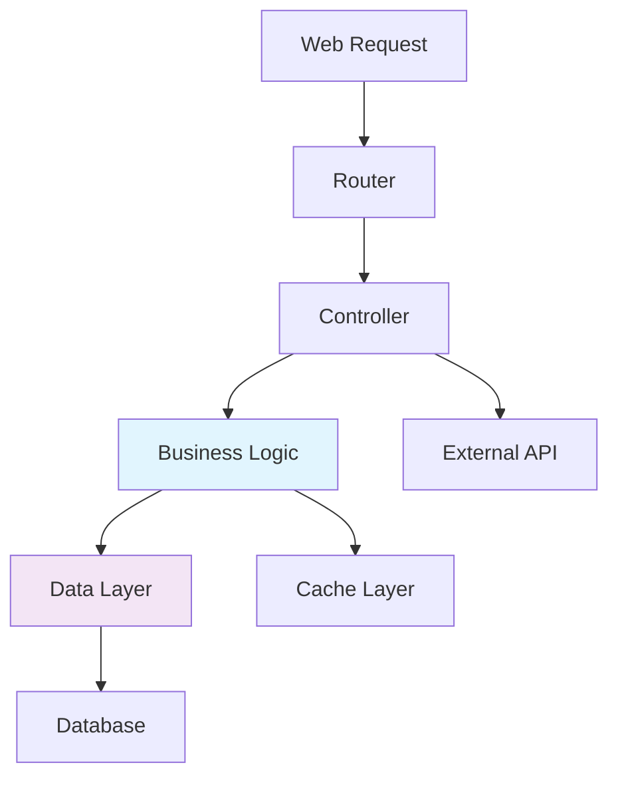
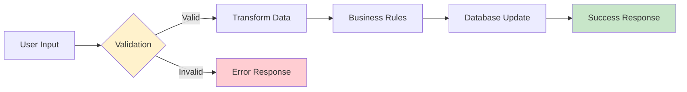
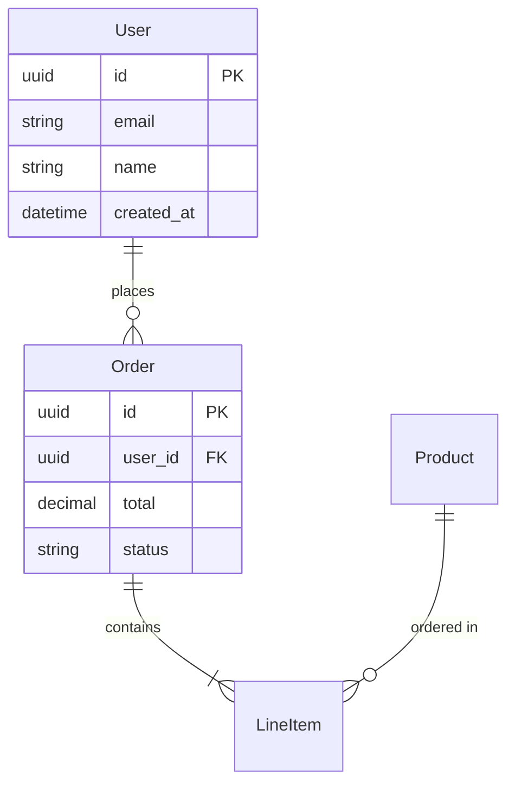
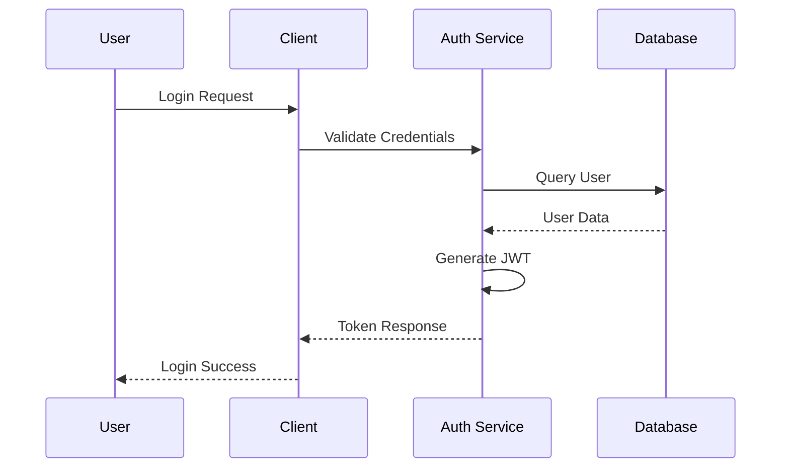
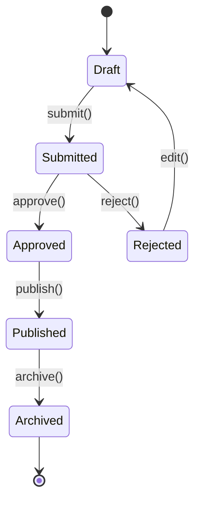

# Specification Generator

Generate comprehensive technical specifications based on the provided $ARGUMENTS. This command supports two modes:

1. **Code Analysis Mode**: When $ARGUMENTS contains a file or directory path, perform recursive analysis of existing code to document the implementation
2. **Description Mode**: When $ARGUMENTS contains a feature description, generate implementation-ready specifications from requirements

The specifications will be placed in the `specs/` folder following a structured hierarchy.

## Instructions for Claude Code Agent

When executing this command, first determine the mode based on $ARGUMENTS:

- **If $ARGUMENTS is a file/directory path**: Execute Code Analysis Mode
- **If $ARGUMENTS is a feature description**: Execute Description Mode

### Mode 1: Code Analysis Phase

When analyzing existing code, examine the code structure in the provided path (recursively analyzing all subdirectories):

#### Core Structure Analysis
- **Identify the main feature/module** from the code organization
- **Map all files and their relationships** (imports, dependencies, function calls)
- **Understand the data flow** and processing pipeline
- **Identify key abstractions** (structs, schemas, behaviours, interfaces)
- **Analyze business logic** and validation rules
- **Document external dependencies** and integrations
- **Identify configuration and customization points**

#### Technology Context Analysis
- **Tech Stack Identification**
  - Programming languages and versions
  - Frameworks and libraries with version constraints
  - Database systems and ORM/query patterns
  - Third-party services and API integrations
- **Build & Deployment Infrastructure**
  - Build tools (mix, npm, gradle, etc.) and configuration
  - Dependency management patterns and lock files
  - Environment configuration strategies
  - Deployment patterns and infrastructure requirements
- **Development Tooling**
  - Code formatting and linting tools
  - Testing frameworks and utilities
  - Development vs. production configurations

#### Analysis Phase Checklist
- [ ] Main entry points identified and documented
- [ ] All module dependencies mapped
- [ ] Technology stack fully catalogued
- [ ] Build and deployment requirements understood
- [ ] External integrations documented
- [ ] Configuration patterns identified

### Mode 2: Description Analysis Phase

When generating specifications from a feature description, perform the following requirements analysis:

#### Requirements Analysis
- **Parse the feature description** to identify core functionality and scope
- **Extract key entities and concepts** mentioned in the description
- **Identify implied business rules** and constraints
- **Determine data requirements** and relationships
- **Assess integration needs** with external systems
- **Identify security and compliance requirements**

#### Technology Context Assessment
- **Evaluate tech stack compatibility** with existing project patterns
- **Identify framework requirements** based on feature complexity
- **Assess database and storage needs** from the description
- **Determine API and integration patterns** required
- **Identify testing and deployment considerations**

#### Description Phase Checklist
- [ ] Core feature requirements extracted and documented
- [ ] Key entities and relationships identified
- [ ] Business rules and constraints documented
- [ ] Technical architecture requirements determined
- [ ] Integration and dependency needs assessed
- [ ] Security and compliance requirements identified

### 3. Specification Generation

Create detailed specifications following this structure:

#### Main Specification File: `specs/<feature>.md`

```markdown
# <Feature Name> Specification

## 1. Purpose
[Clear description of what this feature/module does and why it exists]

## 2. Core Concepts
[Define key terms, entities, and abstractions used throughout the system]
- **Term 1:** Definition and context
- **Term 2:** Definition and context

## 3. Functionality
[Describe the main functions and capabilities]
- **Function 1:** What it does, inputs, outputs
- **Function 2:** What it does, inputs, outputs
- Include flowcharts for complex business processes and decision logic

## 4. Data Model / Structure
[Document all data structures, schemas, and their relationships]
- Include example data for each structure
- Show field types and constraints
- Document relationships between entities
- Include entity relationship diagrams using MermaidJS for complex data models

## 5. Business Rules & Validations
[Critical business logic and constraints]
- List all validation rules
- Document processing requirements
- Include performance considerations

## 6. Implementation Considerations
[Technical details for implementation]
- Architecture patterns used
- Error handling strategies
- Testing requirements
- Security considerations

## 7. Module Overview
[Table of core modules with descriptions and links]

## 8. Future Enhancements
[Potential improvements or extensions]
```

#### Sub-specification Files: `specs/<feature>/<topic>.md`

For complex topics that warrant separate documentation:

```markdown
# <Topic Name> Specification

## Purpose
[Why this component exists and its role in the larger system]

## Interface/API
[Public functions, parameters, return types]

## Implementation Details
[How it works internally]

## Data Structures
[Specific schemas/structs used]

## Business Logic
[Rules and algorithms specific to this component]

## Error Handling
[How errors are managed]

## Testing Strategy
[How to test this component]

## Dependencies
[What this component relies on]

## Performance Considerations
[Scalability and optimization notes]
```

#### Visual Documentation Integration

Enhance specifications with MermaidJS diagrams where they clarify complex relationships or flows:

**Required Diagram Types:**
- **System Architecture**: Overall module relationships and data flow
- **Core Business Processes**: Key workflows and decision points
- **Data Models**: Entity relationships and schema structure

**Optional Diagram Types (when they add clarity):**
- **API Interaction Sequences**: For complex multi-step processes
- **State Transitions**: For stateful components or user workflows
- **Deployment Flows**: For operations and infrastructure sections

**MermaidJS Integration Guidelines:**
```markdown
## System Architecture



**Diagram Standards:**
- Keep diagrams focused on a single concept or flow
- Use consistent styling and naming conventions
- Include diagram titles and brief explanations
- Limit complexity to 15-20 nodes maximum per diagram
- Use colors sparingly to highlight key components

### 4. Quality Standards

Ensure specifications meet these criteria:

#### Completeness
- **All public APIs documented** with parameters and return types
- **All data structures detailed** with examples and field descriptions
- **Business rules explicitly stated** with rationale
- **Dependencies and integrations mapped**
- **Error scenarios covered**

#### Clarity
- **Use clear, technical language** appropriate for developers
- **Provide concrete examples** for complex concepts
- **Include code snippets strategically** following these guidelines:
  - Use full code snippets (5-15 lines) for key algorithms or complex business logic
  - Use pseudocode for high-level flows or when language-agnostic description is needed
  - Use function signatures and types for API documentation
  - Avoid reproducing large blocks (>20 lines) - instead describe the approach and reference the file
  - Include realistic data examples for schemas and data structures
- **Use consistent terminology** throughout

#### Cross-Reference Standards
- **Internal Links**: Use relative paths for linking between specifications (`[API Spec](./api.md)`)
- **Code References**: Include file paths and line numbers for specific implementations (`auth.ex:45-67`)
- **Dependency Mapping**: Create clear dependency graphs showing relationships between components
- **Terminology Consistency**: Maintain a glossary of domain terms used across all specifications
- **Version Synchronization**: Ensure all cross-references remain valid when code evolves

#### Visual Documentation with MermaidJS
- **Flow Charts**: Use for data processing pipelines, business logic flows, and decision trees
- **Architecture Diagrams**: Document module relationships, dependency graphs, and system boundaries
- **Entity Relationships**: Show data model connections and database schema relationships
- **Sequence Diagrams**: Illustrate API interactions, authentication flows, and multi-step processes
- **State Diagrams**: Document workflow states, user journey flows, and system state transitions

#### Usability
- **Specifications should be implementation-ready** - a developer should be able to recreate the system from the specs
- **Include architectural decisions** and their rationale
- **Document assumptions and constraints**
- **Provide troubleshooting guidance**

#### Structure
- **Follow the hierarchy**: main spec in `specs/<feature>.md`, subtopics in `specs/<feature>/<subtopic>.md`
- **Use consistent markdown formatting**
- **Include table of contents for long documents**
- **Cross-reference related specifications**

### 5. Analysis Focus Areas

Pay special attention to:

#### Architecture Patterns
- **Identify design patterns** used (e.g., behaviour pattern, factory pattern, pipeline pattern)
- **Document module boundaries** and responsibilities
- **Map data flow** between components

#### Security & Compliance Analysis
- **Authentication & Authorization Patterns**
  - User authentication mechanisms and session management
  - Role-based access control and permission systems
  - API security patterns (tokens, keys, OAuth flows)
- **Data Protection & Privacy**
  - Sensitive data handling and encryption patterns
  - PII identification and protection measures
  - Data retention and deletion policies
- **Security Boundaries**
  - Input validation and sanitization strategies
  - SQL injection and XSS prevention measures
  - Rate limiting and abuse prevention
- **Compliance Requirements**
  - Industry-specific regulations (GDPR, HIPAA, PCI, etc.)
  - Audit logging and compliance reporting
  - Data sovereignty and geographic restrictions

#### Testing Strategy Analysis
- **Existing Test Patterns**
  - Unit test coverage and organization
  - Integration test strategies and dependencies
  - End-to-end test scenarios and tools
- **Test Data Management**
  - Factory patterns and test data generation
  - Database seeding and cleanup strategies
  - Mock and stub usage patterns
- **Quality Assurance Practices**
  - Code coverage requirements and measurement
  - Performance testing and benchmarking
  - Security testing and vulnerability scanning
- **Testing Infrastructure**
  - CI/CD pipeline integration
  - Test environment management
  - Parallel test execution strategies

#### Operations & Deployment Analysis
- **Environment Management**
  - Development, staging, and production configurations
  - Environment variable management and secrets handling
  - Feature flag and deployment strategies
- **Monitoring & Observability**
  - Logging patterns and structured logging
  - Metrics collection and alerting
  - Distributed tracing and performance monitoring
- **Deployment Patterns**
  - Blue-green, canary, or rolling deployment strategies
  - Database migration patterns and rollback procedures
  - Container orchestration and scaling policies
- **Operational Procedures**
  - Incident response and recovery procedures
  - Backup and disaster recovery strategies
  - Maintenance windows and update procedures

#### Legacy Code & Technical Debt
- **Code Quality Assessment**
  - Identify deprecated patterns and outdated dependencies
  - Document technical debt and refactoring opportunities
  - Note deviations from current best practices
- **Migration Strategies**
  - Document planned migrations and upgrade paths
  - Identify compatibility layers and shims
  - Note breaking changes and migration requirements
- **Historical Context**
  - Document why certain decisions were made
  - Identify temporary solutions that became permanent
  - Note constraints that influenced implementation choices

#### Configuration & Customization
- **Document configurable parameters**
- **Identify extension points**
- **Note environment-specific behavior**

#### Data Handling
- **Input validation and sanitization**
- **Data transformation pipelines**
- **Storage and retrieval patterns**
- **Caching strategies**

#### Integration Points
- **External service dependencies**
- **Database interactions**
- **API endpoints**
- **Event handling**

#### Performance & Scalability
- **Bottlenecks and optimization opportunities**
- **Concurrent processing patterns**
- **Resource usage patterns**
- **Scaling considerations**

### 6. Example Analysis Process

#### Prioritization Strategy

For large codebases, use this framework to determine analysis depth:

**Core Components (Deep Analysis)**
- Main application entry points and routing
- Business logic modules with complex rules
- Data access layers and critical integrations
- Security-sensitive components
- Performance-critical paths

**Supporting Components (Medium Analysis)**
- Utility modules and helpers
- Configuration and setup code
- Secondary features and extensions
- Internal tools and scripts

**Peripheral Components (Light Analysis)**
- Development tooling and build scripts
- Test utilities and fixtures
- Documentation and examples
- Deprecated or unused code

**Decision Criteria:**
- Business impact if component fails
- Frequency of modification
- Complexity and coupling with other systems
- Number of external dependencies

#### Systematic Analysis Steps

1. **Start with the entry point** - identify the main module or API
2. **Trace data flow** - follow how data moves through the system
3. **Map dependencies** - understand what external systems are used
4. **Identify patterns** - look for repeated structures or behaviors
5. **Document edge cases** - understand error handling and boundary conditions
6. **Extract business rules** - identify domain-specific logic
7. **Note technical decisions** - understand why certain approaches were chosen
8. **Assess security boundaries** - identify trust boundaries and validation points
9. **Document operational concerns** - understand deployment and monitoring requirements
10. **Identify improvement opportunities** - note technical debt and optimization potential

#### Analysis Phase Validation
- [ ] All core components analyzed in depth
- [ ] Critical data flows documented
- [ ] Security boundaries identified
- [ ] Operational requirements understood
- [ ] Technical decisions and their rationale captured

### 7. Deliverables

- **Main specification file** at `specs/<feature>.md`
- **Sub-specification files** at `specs/<feature>/<topic>.md` for complex components
- **All files should be complete** and ready for use by development teams
- **Cross-references should be accurate** and helpful
- **Examples should be realistic** and demonstrate actual usage

### 8. Description Mode Guidelines

When using Description Mode, provide clear, detailed feature descriptions that include:

#### Effective Feature Descriptions Should Include:

**Core Functionality**
- Clear statement of what the feature does
- Primary user goals and use cases
- Key workflows and user interactions
- Success criteria and acceptance requirements

**Business Context**
- Why this feature is needed
- Business value and impact
- User personas or roles involved
- Integration with existing features

**Technical Requirements**
- Data that needs to be stored or processed
- External systems or APIs to integrate with
- Performance or scalability requirements
- Security and compliance considerations

**Example Description Formats:**

**Good Description Example:**
```
"Implement a user notification system that allows administrators to send targeted messages to specific user groups. Users should receive notifications via email and in-app alerts. The system needs to support scheduled delivery, message templates, and delivery tracking. Notifications should be stored for 30 days and support basic analytics (open rates, click-through rates). Integration with existing user management and email service is required."
```

**Poor Description Example:**
```
"Add notifications to the app"
```

#### Description Best Practices:
- Be specific about user interactions and workflows
- Include data requirements and relationships
- Mention integration points with existing systems
- Specify any compliance or security requirements
- Include performance expectations when relevant
- Describe the scope boundaries (what's included/excluded)

### 9. Specification Examples & Guidelines

#### Good vs. Poor Specification Content

**Good Example - API Function Documentation:**
```markdown
## User Authentication

### `authenticate_user(email, password) -> {:ok, user} | {:error, reason}`

**Purpose:** Validates user credentials and returns authenticated user data.

**Parameters:**
- `email` (string): User email address, must be valid email format
- `password` (string): Plain text password, minimum 8 characters

**Returns:**
- `{:ok, %User{}}` - Authentication successful, returns user struct
- `{:error, :invalid_credentials}` - Email/password combination invalid
- `{:error, :account_locked}` - Account temporarily locked due to failed attempts

**Business Rules:**
- Account locks after 5 failed attempts within 15 minutes
- Passwords are hashed using bcrypt with cost factor 12
- Email lookup is case-insensitive

**Example Usage:**
```elixir
case authenticate_user("user@example.com", "securepass123") do
  {:ok, user} -> redirect_to_dashboard(user)
  {:error, reason} -> show_error_message(reason)
end
```

**Poor Example:**
```markdown
## Authentication
This function authenticates users. Pass in email and password.
```

#### Content Guidelines by Section Type

**Data Structure Documentation:**
- Always include example data with realistic values
- Document field constraints (required, optional, format, length)
- Show relationships between entities with examples
- Include validation rules and error scenarios

**Business Logic Documentation:**
- State the rule clearly with concrete examples
- Explain the business rationale when not obvious
- Document exceptions and edge cases
- Include performance implications for complex rules

**API Documentation:**
- Full function signatures with parameter and return types
- All possible return values and error conditions
- Realistic usage examples
- Authentication and authorization requirements

#### MermaidJS Diagram Examples

**Data Flow Diagram:**


**Entity Relationship Diagram:**


**Authentication Sequence:**


**State Machine Diagram:**


#### Quality Validation Checklist

**Completeness Checklist:**
- [ ] All public APIs documented with examples
- [ ] All data structures include field descriptions and constraints
- [ ] Business rules stated with clear rationale
- [ ] Error scenarios and handling documented
- [ ] Dependencies and integrations mapped
- [ ] Security considerations addressed
- [ ] Performance characteristics noted
- [ ] Testing strategies outlined
- [ ] Key system flows visualized with appropriate diagrams

**Clarity Checklist:**
- [ ] Technical language appropriate for target audience
- [ ] Examples are realistic and demonstrative
- [ ] Code snippets follow established guidelines
- [ ] Terminology used consistently throughout
- [ ] Cross-references are accurate and helpful
- [ ] Diagrams enhance understanding without adding complexity

**Usability Checklist:**
- [ ] Specifications are implementation-ready
- [ ] Architectural decisions and rationale documented
- [ ] Assumptions and constraints clearly stated
- [ ] Troubleshooting guidance provided
- [ ] Migration and upgrade paths documented
- [ ] Diagrams are properly integrated with text explanations

Remember: The goal is to create specifications detailed enough that a competent developer could implement the system from scratch using only these documents, while also serving as comprehensive documentation for the existing codebase.